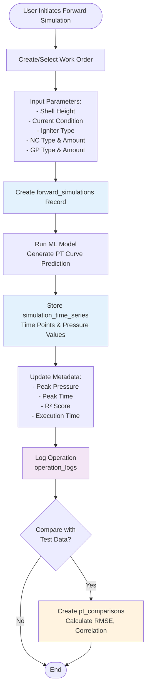
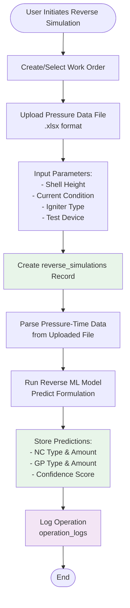
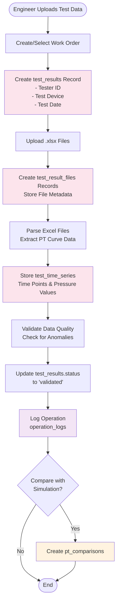
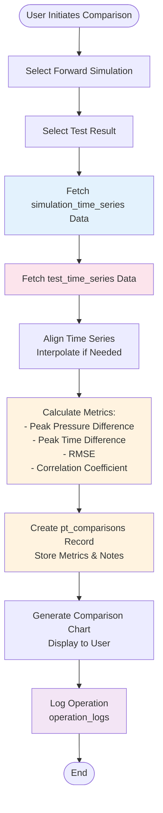
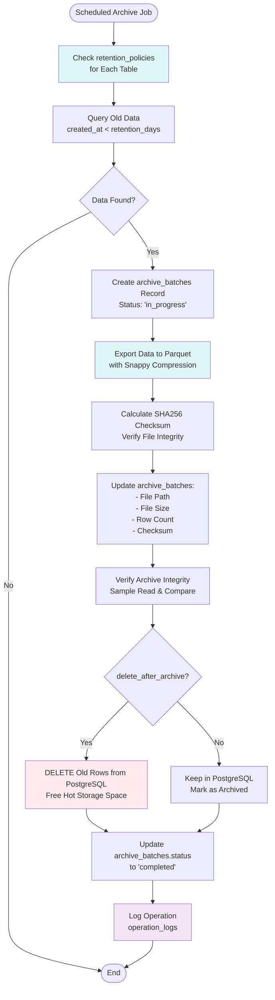
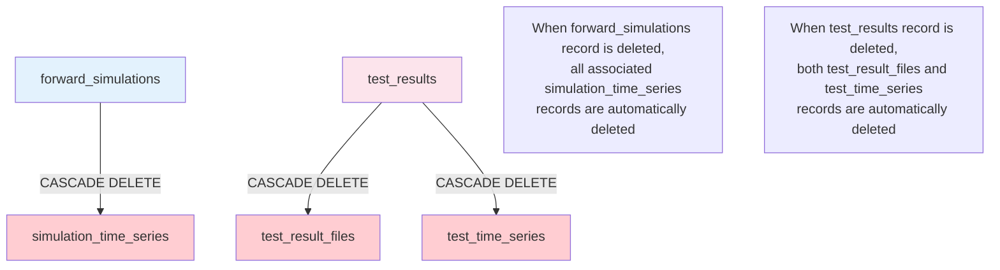

# MGG Database Schema Visualization

## Overview

This document provides comprehensive visual documentation of the MGG Simulation System database schema. It complements [README.md](README.md) (which covers architecture, installation, and operations) with detailed entity-relationship diagrams and data flow visualizations.

**Database**: PostgreSQL 15
**Tables**: 17
**Foreign Keys**: 22 relationships
**Indexes**: 38 optimized indexes
**Views**: 2 materialized query views
**Triggers**: 3 auto-update triggers

> For architecture overview, hot-cold storage strategy, and installation instructions, see [README.md](README.md)

---

## Complete Entity-Relationship Diagram

The following ERD shows all 17 tables and their relationships. Tables are organized into 8 functional groups.

```mermaid
erDiagram
    %% ============================================
    %% GROUP 1: Authentication & Access Control
    %% ============================================
    users {
        serial id PK
        varchar username UK
        varchar email UK
        varchar password_hash
        varchar full_name
        varchar role "admin, user, engineer"
        varchar department
        boolean is_active
        timestamp created_at
        timestamp updated_at
        timestamp last_login
        integer created_by FK
    }

    %% Self-referential relationship
    users ||--o{ users : "created_by"

    %% ============================================
    %% GROUP 2: Configuration/Reference Data
    %% ============================================
    igniter_types {
        serial id PK
        varchar type_code UK
        text description
        boolean is_active
        timestamp created_at
    }

    nc_types {
        serial id PK
        varchar type_code UK
        text description
        decimal density
        decimal specific_heat
        boolean is_active
        timestamp created_at
    }

    gp_types {
        serial id PK
        varchar type_code UK
        text description
        decimal density
        decimal specific_heat
        boolean is_active
        timestamp created_at
    }

    test_devices {
        serial id PK
        varchar device_code UK
        varchar device_name
        varchar location
        date calibration_date
        boolean is_active
        timestamp created_at
    }

    %% ============================================
    %% GROUP 3: Work Order Management
    %% ============================================
    work_orders {
        serial id PK
        varchar work_order_number UK "WO-YYYYMMDD-HHMMSS"
        integer created_by FK
        varchar status "pending, in_progress, completed, cancelled"
        varchar priority "low, normal, high, urgent"
        text description
        timestamp created_at
        timestamp updated_at
        timestamp completed_at
    }

    users ||--o{ work_orders : "creates"

    %% ============================================
    %% GROUP 4: Forward Simulation (正向仿真)
    %% ============================================
    forward_simulations {
        serial id PK
        integer work_order_id FK
        integer user_id FK
        decimal shell_height
        decimal current_condition
        integer igniter_type_id FK
        integer nc_type_id FK
        decimal nc_amount "NC用量1(mg)"
        integer gp_type_id FK
        decimal gp_amount
        varchar model_version
        integer num_models
        decimal r_squared
        decimal peak_pressure "MPa"
        decimal peak_time "ms"
        integer num_data_points
        varchar simulation_type
        varchar status
        decimal execution_time
        text error_message
        timestamp created_at
    }

    simulation_time_series {
        serial id PK
        integer simulation_id FK "CASCADE DELETE"
        decimal time_point "ms"
        decimal pressure "MPa"
        integer sequence_number
        timestamp created_at
    }

    users ||--o{ forward_simulations : "runs"
    work_orders ||--o{ forward_simulations : "contains"
    igniter_types ||--o{ forward_simulations : "uses"
    nc_types ||--o{ forward_simulations : "uses"
    gp_types ||--o{ forward_simulations : "uses"
    forward_simulations ||--o{ simulation_time_series : "generates CASCADE"

    %% ============================================
    %% GROUP 5: Reverse Simulation (逆向仿真)
    %% ============================================
    reverse_simulations {
        serial id PK
        integer work_order_id FK
        integer user_id FK
        decimal shell_height
        decimal current_condition
        integer igniter_type_id FK
        integer test_device_id FK
        varchar pressure_data_file
        integer predicted_nc_type_id FK
        decimal predicted_nc_amount
        integer predicted_gp_type_id FK
        decimal predicted_gp_amount
        decimal confidence_score
        varchar model_version
        varchar status
        decimal execution_time
        text error_message
        timestamp created_at
    }

    users ||--o{ reverse_simulations : "runs"
    work_orders ||--o{ reverse_simulations : "contains"
    igniter_types ||--o{ reverse_simulations : "uses"
    test_devices ||--o{ reverse_simulations : "uses"
    nc_types ||--o{ reverse_simulations : "predicts"
    gp_types ||--o{ reverse_simulations : "predicts"

    %% ============================================
    %% GROUP 6: Testing (实验结果)
    %% ============================================
    test_results {
        serial id PK
        integer work_order_id FK
        integer user_id FK
        varchar tester_id
        integer test_device_id FK
        date test_date
        text notes
        varchar status "submitted, validated, archived"
        timestamp created_at
        timestamp updated_at
    }

    test_result_files {
        serial id PK
        integer test_result_id FK "CASCADE DELETE"
        varchar file_name
        varchar file_path
        bigint file_size
        varchar file_type
        timestamp uploaded_at
    }

    test_time_series {
        serial id PK
        integer test_result_id FK "CASCADE DELETE"
        integer file_id FK
        decimal time_point "ms"
        decimal pressure "MPa"
        integer sequence_number
        timestamp created_at
    }

    users ||--o{ test_results : "submits"
    work_orders ||--o{ test_results : "contains"
    test_devices ||--o{ test_results : "uses"
    test_results ||--o{ test_result_files : "includes CASCADE"
    test_results ||--o{ test_time_series : "generates CASCADE"
    test_result_files ||--o{ test_time_series : "sources"

    %% ============================================
    %% GROUP 7: Analysis & Comparison
    %% ============================================
    pt_comparisons {
        serial id PK
        integer user_id FK
        integer simulation_id FK
        integer test_result_id FK
        decimal peak_pressure_diff "MPa"
        decimal peak_time_diff "ms"
        decimal rmse
        decimal correlation
        text notes
        timestamp created_at
    }

    users ||--o{ pt_comparisons : "performs"
    forward_simulations ||--o{ pt_comparisons : "compared_in"
    test_results ||--o{ pt_comparisons : "compared_in"

    %% ============================================
    %% GROUP 8: System & Archive
    %% ============================================
    operation_logs {
        serial id PK
        integer user_id FK
        varchar log_type "login, simulation, upload, download, comparison, work_order, navigation, admin"
        varchar action
        text details
        inet ip_address
        text user_agent
        timestamp created_at
    }

    archive_batches {
        serial id PK
        varchar batch_name UK
        varchar table_name
        timestamp start_date
        timestamp end_date
        bigint row_count
        varchar parquet_file_path
        bigint parquet_file_size
        varchar compression_type
        timestamp archived_at
        integer archived_by FK
        varchar status
        varchar checksum "SHA256"
    }

    model_versions {
        serial id PK
        varchar version_name UK
        varchar model_type "forward, reverse"
        varchar file_path
        integer num_models
        date training_date
        decimal r_squared
        text description
        boolean is_active
        timestamp created_at
        integer created_by FK
    }

    retention_policies {
        serial id PK
        varchar table_name UK
        integer retention_days
        boolean archive_enabled
        boolean delete_after_archive
        timestamp last_cleanup_at
        timestamp created_at
        timestamp updated_at
    }

    users ||--o{ operation_logs : "generates"
    users ||--o{ archive_batches : "archives"
    users ||--o{ model_versions : "creates"
```



---

## Workflow Diagrams

### 1. Forward Simulation Workflow (正向仿真)



### 2. Reverse Simulation Workflow (逆向仿真)



### 3. Test Results Upload & Processing (实验结果)



### 4. PT Curve Comparison Analysis (PT曲线对比)



### 5. Data Archival & Retention Process



---

## Foreign Key Relationships Reference

### Complete Relationship Matrix

| Parent Table | Child Table | FK Column | Cascade Delete | Purpose |
|--------------|-------------|-----------|----------------|---------|
| users | users | created_by | No | Track user creation hierarchy |
| users | work_orders | created_by | No | Link work orders to creators |
| users | forward_simulations | user_id | No | Track simulation ownership |
| users | reverse_simulations | user_id | No | Track simulation ownership |
| users | test_results | user_id | No | Track test result ownership |
| users | pt_comparisons | user_id | No | Track comparison ownership |
| users | operation_logs | user_id | No | Audit trail per user |
| users | archive_batches | archived_by | No | Track who performed archive |
| users | model_versions | created_by | No | Track model version creators |
| igniter_types | forward_simulations | igniter_type_id | No | Configuration reference |
| igniter_types | reverse_simulations | igniter_type_id | No | Configuration reference |
| nc_types | forward_simulations | nc_type_id | No | NC material specification |
| nc_types | reverse_simulations | predicted_nc_type_id | No | Reverse prediction result |
| gp_types | forward_simulations | gp_type_id | No | GP material specification |
| gp_types | reverse_simulations | predicted_gp_type_id | No | Reverse prediction result |
| test_devices | reverse_simulations | test_device_id | No | Device used for reverse sim |
| test_devices | test_results | test_device_id | No | Device used for testing |
| work_orders | forward_simulations | work_order_id | No | Link simulations to work orders |
| work_orders | reverse_simulations | work_order_id | No | Link simulations to work orders |
| work_orders | test_results | work_order_id | No | Link tests to work orders |
| **forward_simulations** | **simulation_time_series** | **simulation_id** | **YES** | **PT curve data (cascade delete)** |
| forward_simulations | pt_comparisons | simulation_id | No | Link comparisons to simulations |
| **test_results** | **test_result_files** | **test_result_id** | **YES** | **Uploaded files (cascade delete)** |
| **test_results** | **test_time_series** | **test_result_id** | **YES** | **PT curve data (cascade delete)** |
| test_results | pt_comparisons | test_result_id | No | Link comparisons to test results |
| test_result_files | test_time_series | file_id | No | Link time series to source file |

### CASCADE DELETE Relationships

Three critical relationships use CASCADE DELETE to maintain data integrity:



**Rationale**: Time series data and uploaded files have no meaning without their parent records. CASCADE DELETE prevents orphaned data and maintains referential integrity.

---

## Index Strategy (38 Indexes)

### Primary Key Indexes (17)
Every table has a primary key index on the `id` column (auto-created by `SERIAL PRIMARY KEY`).

### Unique Constraint Indexes (13)
| Table | Column | Purpose |
|-------|--------|---------|
| users | username | Enforce unique usernames for authentication |
| users | email | Prevent duplicate email addresses |
| igniter_types | type_code | Unique material codes |
| nc_types | type_code | Unique material codes |
| gp_types | type_code | Unique material codes |
| test_devices | device_code | Unique device identifiers |
| work_orders | work_order_number | Unique work order numbers (WO-YYYYMMDD-HHMMSS) |
| archive_batches | batch_name | Unique batch identifiers |
| model_versions | version_name | Unique model version names |
| retention_policies | table_name | One policy per table |

### Foreign Key Indexes (9)
| Table | Column | Purpose |
|-------|--------|---------|
| work_orders | created_by | Fast user lookup |
| forward_simulations | user_id | Filter simulations by user |
| forward_simulations | work_order_id | Link to work orders |
| reverse_simulations | user_id | Filter simulations by user |
| reverse_simulations | work_order_id | Link to work orders |
| test_results | user_id | Filter tests by user |
| test_results | work_order_id | Link to work orders |
| test_results | test_device_id | Filter by device |
| simulation_time_series | simulation_id | Fast time series lookup |
| test_time_series | test_result_id | Fast time series lookup |
| test_time_series | file_id | Link to source file |
| test_result_files | test_result_id | Filter files by test |
| pt_comparisons | user_id | Filter comparisons by user |
| pt_comparisons | simulation_id | Link to simulation |
| pt_comparisons | test_result_id | Link to test |
| operation_logs | user_id | Filter logs by user |

### Query Optimization Indexes (18)
| Table | Index | Purpose |
|-------|-------|---------|
| users | role | Filter by user role (admin/user/engineer) |
| users | is_active | Filter active users |
| work_orders | status | Filter by status (pending/in_progress/completed) |
| work_orders | created_at DESC | Recent work orders |
| forward_simulations | created_at DESC | Recent simulations |
| forward_simulations | nc_amount | Search by NC dosage |
| reverse_simulations | created_at DESC | Recent simulations |
| test_results | test_date DESC | Recent tests |
| pt_comparisons | created_at DESC | Recent comparisons |
| operation_logs | log_type | Filter by log type |
| operation_logs | created_at DESC | Recent logs |
| operation_logs | (user_id, log_type) | Composite: user activity by type |
| simulation_time_series | (simulation_id, sequence_number) | Ordered curve data retrieval |
| test_time_series | (test_result_id, sequence_number) | Ordered curve data retrieval |
| archive_batches | table_name | Filter archives by source table |
| archive_batches | (start_date, end_date) | Date range queries |
| archive_batches | status | Filter by archive status |
| model_versions | model_type | Filter by forward/reverse |
| model_versions | is_active | Find active models |

---

## Database Views (2)

### 1. v_active_simulations

**Purpose**: Quick access to completed forward simulations with user and work order context.

**SQL Definition**:
```sql
CREATE VIEW v_active_simulations AS
SELECT
    fs.id,
    wo.work_order_number,
    u.username,
    u.full_name,
    fs.nc_amount,
    fs.peak_pressure,
    fs.peak_time,
    fs.created_at
FROM forward_simulations fs
JOIN users u ON fs.user_id = u.id
LEFT JOIN work_orders wo ON fs.work_order_id = wo.id
WHERE fs.status = 'completed'
ORDER BY fs.created_at DESC;
```

**Use Cases**:
- Dashboard display of recent simulations
- Quick filtering by NC amount
- User activity monitoring
- Work order progress tracking

**Performance**: Uses indexes on `forward_simulations.status`, `forward_simulations.created_at`, and FK indexes.

---

### 2. v_test_results_summary

**Purpose**: Aggregated view of test results with file counts and device information.

**SQL Definition**:
```sql
CREATE VIEW v_test_results_summary AS
SELECT
    tr.id,
    wo.work_order_number,
    u.username,
    tr.tester_id,
    td.device_name,
    tr.test_date,
    COUNT(trf.id) as file_count,
    tr.created_at
FROM test_results tr
JOIN users u ON tr.user_id = u.id
LEFT JOIN work_orders wo ON tr.work_order_id = wo.id
LEFT JOIN test_devices td ON tr.test_device_id = td.id
LEFT JOIN test_result_files trf ON tr.id = trf.test_result_id
GROUP BY tr.id, wo.work_order_number, u.username, tr.tester_id, td.device_name, tr.test_date, tr.created_at
ORDER BY tr.created_at DESC;
```

**Use Cases**:
- Test result listing with file count
- Device utilization tracking
- Tester activity monitoring
- Work order test status

**Performance**: Uses indexes on FK columns and `test_results.created_at`.

---

## Database Triggers (3)

### Automatic Timestamp Updates

Three tables have `updated_at` columns that automatically update when records are modified.

**Function Definition**:
```sql
CREATE OR REPLACE FUNCTION update_updated_at_column()
RETURNS TRIGGER AS $$
BEGIN
    NEW.updated_at = CURRENT_TIMESTAMP;
    RETURN NEW;
END;
$$ language 'plpgsql';
```

**Applied To**:

1. **users** - Tracks when user records are modified
```sql
CREATE TRIGGER update_users_updated_at
BEFORE UPDATE ON users
FOR EACH ROW EXECUTE FUNCTION update_updated_at_column();
```

2. **work_orders** - Tracks work order status changes
```sql
CREATE TRIGGER update_work_orders_updated_at
BEFORE UPDATE ON work_orders
FOR EACH ROW EXECUTE FUNCTION update_updated_at_column();
```

3. **test_results** - Tracks test result modifications
```sql
CREATE TRIGGER update_test_results_updated_at
BEFORE UPDATE ON test_results
FOR EACH ROW EXECUTE FUNCTION update_updated_at_column();
```

**Purpose**: Maintain accurate audit trails without requiring application-level logic.

---

## Data Retention Summary

From `retention_policies` table (defined in [schema.sql](schema.sql:374-380)):

| Table | Hot Retention | Archive | Delete After Archive |
|-------|--------------|---------|---------------------|
| operation_logs | 90 days | Yes | Yes |
| simulation_time_series | 180 days | Yes | Yes |
| test_time_series | 365 days | Yes | Yes |
| forward_simulations | 365 days | No | No (metadata kept) |
| reverse_simulations | 365 days | No | No (metadata kept) |
| test_results | 730 days | No | No (metadata kept) |

**Strategy**: Archive bulk time series data to Parquet files to reduce PostgreSQL storage, but keep metadata in hot storage for fast queries.

---

## Key Design Patterns

### 1. Work Order as Orchestration Hub
- Central entity linking simulations and test results
- Supports project-based organization
- Tracks lifecycle from creation to completion

### 2. Time Series Data Separation
- Large time series data stored separately from metadata
- Enables efficient archival of bulk data
- Maintains query performance on metadata

### 3. Configuration as Reference Data
- Material types (igniter, NC, GP) and devices managed centrally
- Enables consistency across simulations
- Supports future expansions without schema changes

### 4. Dual Simulation Modes
- **Forward**: Predict PT curve from formulation
- **Reverse**: Predict formulation from PT curve
- Both support comparison with experimental data

### 5. Comprehensive Audit Trail
- All user actions logged in `operation_logs`
- IP address and user agent tracking
- 90-day retention with archival

### 6. Hot-Cold Data Architecture
- Active data in PostgreSQL for fast queries
- Historical data in Parquet for cost-effective storage
- Automated archival based on retention policies
- SHA256 checksums for data integrity verification

---

## Verification Commands

### View All Tables
```bash
psql -U mgg_user -d mgg_simulation -c "\dt"
```

### Show Table Structure
```bash
psql -U mgg_user -d mgg_simulation -c "\d forward_simulations"
```

### List All Foreign Keys
```sql
SELECT
    tc.table_name,
    kcu.column_name,
    ccu.table_name AS foreign_table_name,
    ccu.column_name AS foreign_column_name,
    rc.delete_rule
FROM information_schema.table_constraints AS tc
JOIN information_schema.key_column_usage AS kcu
    ON tc.constraint_name = kcu.constraint_name
JOIN information_schema.constraint_column_usage AS ccu
    ON ccu.constraint_name = tc.constraint_name
JOIN information_schema.referential_constraints AS rc
    ON rc.constraint_name = tc.constraint_name
WHERE tc.constraint_type = 'FOREIGN KEY'
ORDER BY tc.table_name;
```

### List All Indexes
```sql
SELECT
    tablename,
    indexname,
    indexdef
FROM pg_indexes
WHERE schemaname = 'public'
ORDER BY tablename, indexname;
```

### View Table Sizes
```sql
SELECT
    tablename,
    pg_size_pretty(pg_total_relation_size(schemaname||'.'||tablename)) AS size
FROM pg_tables
WHERE schemaname = 'public'
ORDER BY pg_total_relation_size(schemaname||'.'||tablename) DESC;
```

---

## Related Documentation

- [README.md](README.md) - Architecture overview, installation, performance tuning
- [schema.sql](schema.sql) - Complete SQL schema definition
- [db_config.py](db_config.py) - Database connection management
- [models.py](models.py) - SQLAlchemy ORM models
- [archive_manager.py](archive_manager.py) - Parquet archival implementation

---

**Last Updated**: 2026-01-19
**Database Version**: PostgreSQL 15
**Schema Version**: 1.0
**Maintained By**: MGG Development Team
